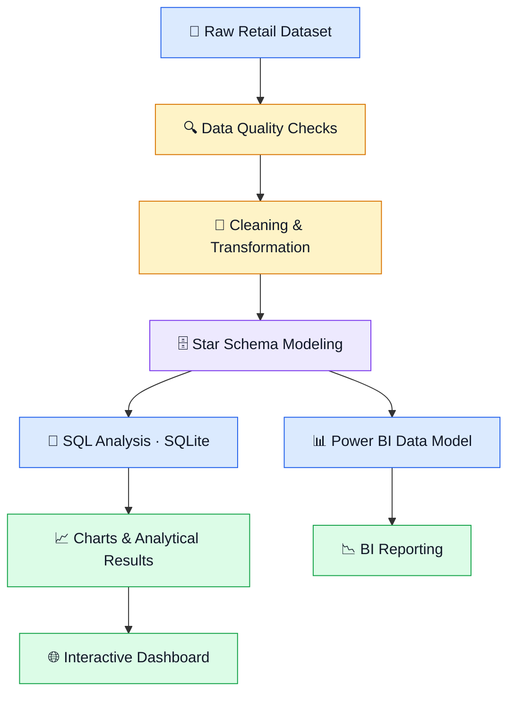
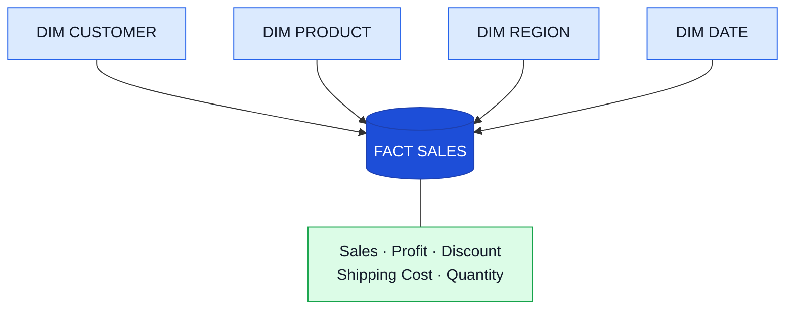

<div align="center">

# 📊 Superstore Sales & Profitability Intelligence

### Turning Retail Data into Business Decisions

**Data Analytics · SQL · Python · Power BI · Business Intelligence**

[](https://www.python.org/)
[](sql/01_analysis_queries.sql)
[](powerbi_guide/POWERBI_GUIDE.md)
[](https://pandas.pydata.org/)
[](https://shubham-k-jha.github.io/superstore-analysis/)

<br/>

<a href="https://shubham-k-jha.github.io/superstore-analysis/">
  <strong>🚀 EXPLORE THE INTERACTIVE DASHBOARD →</strong>
</a>

<br/><br/>

<a href="sql/01_analysis_queries.sql">SQL Analysis</a> •
<a href="powerbi_guide/POWERBI_GUIDE.md">Power BI Guide</a> •
<a href="https://github.com/shubham-k-jha/superstore-analysis">Source Code</a>

</div>

---

## 🎯 The Business Challenge

> **Are high sales actually generating high profits—or are discounts, products, and operational inefficiencies quietly destroying margins?**

Sales revenue alone does not tell the whole story. A product can sell well while losing money, and a profitable business can still have a large proportion of loss-making transactions.

This project transforms historical retail transactions into actionable insights through data cleaning, dimensional modeling, SQL analysis, visualization, and dashboard development.

## 📌 Project at a Glance

<table>
<tr>
<td align="center" width="25%">

### 8,399

**Transaction Lines**

</td>
<td align="center" width="25%">

### 5,496

**Orders**

</td>
<td align="center" width="25%">

### 2009–2012

**Data Period**

</td>
<td align="center" width="25%">

### 8

**SQL Questions**

</td>
</tr>
</table>

> Monetary figures are presented in the source dataset's units. Verify the original dataset's currency denomination before interpreting amounts as CAD. The metrics below are reported analytical results and should be reproduced before being used as audited business findings.

## 🧭 Analytical Workflow



## 💡 Key Business Findings

<table>
<tr>
<td width="50%" valign="top">

### 🔴 01 · Hidden Profitability Issues

# 50.8%

**4,264 of 8,399 transaction lines** reportedly have negative recorded profit.

**Business implication:** Aggregate profitability can hide substantial losses across individual transactions. Investigate performance by product, customer, and region.

</td>
<td width="50%" valign="top">

### 🪑 02 · Furniture Losses

# −$99K

Reported profit for **Tables**.

# −$34K

Reported profit for **Bookcases**.

**Business implication:** Review discounting, product costs, shipping expenses, and pricing before recommending changes.

</td>
</tr>
<tr>
<td width="50%" valign="top">

### 🏷️ 03 · Discount & Margin

# −21.3%

Reported weighted margin for the **11–30% discount band**.

**Business implication:** Higher discounts may coincide with weaker margins. This is a descriptive association, not proof of causation.

</td>
<td width="50%" valign="top">

### 🚚 04 · Shipping Performance

# 4.24 days

Reported average shipping time for low-priority orders, compared with approximately 1.5 days for other priority levels.

**Business implication:** Investigate order queues, processing delays, and shipping workflows.

</td>
</tr>
</table>

**Regional observation:** Nunavut and Newfoundland are identified as lower-profit regions in the current analysis. Further investigation is required to determine whether shipping costs, product mix, order volume, or pricing explain the differences.

*All headline metrics should be validated against freshly generated pipeline outputs. Negative-profit transaction lines are not necessarily equivalent to loss-making orders.*

---

## 📈 Visual Analytics

### Profitability & Product Performance

<table>
<tr>
<td width="50%" align="center">

**Profit by Sub-Category**

<a href="visuals/profit_by_subcategory.png">

</a>

</td>
<td width="50%" align="center">

**Discount vs. Weighted Margin**

<a href="visuals/discount_vs_margin.png">

</a>

</td>
</tr>
<tr>
<td width="50%" align="center">

**Monthly Sales & Profit**

<a href="visuals/monthly_sales_profit_trend.png">

</a>

</td>
<td width="50%" align="center">

**Shipping Days by Mode**

<a href="visuals/shipping_days_by_mode.png">

</a>

</td>
</tr>
</table>

<details>
<summary><strong>📊 View category losses and Power BI dashboard</strong></summary>

<br/>

<table>
<tr>
<td width="50%" align="center">

**Losses by Category**


</td>
<td width="50%" align="center">

**Power BI Dashboard**


</td>
</tr>
</table>

</details>

## 🗄️ Data Modeling Architecture

The project uses a dimensional model designed for analytical queries and Power BI reporting.



### Data Model Components

| Table | Purpose |
|---|---|
| `fact_sales` | Transaction-level sales, profit, discount, and shipping measures |
| `dim_customer` | Customer attributes and segments |
| `dim_product` | Product names, categories, and sub-categories |
| `dim_region` | Geographic attributes |
| `dim_date` | Calendar attributes for time-based analysis |

**Power BI-ready files:** `data/powerbi/`

See the [Power BI Build Guide](powerbi_guide/POWERBI_GUIDE.md) for relationships, DAX measures, KPI design, and dashboard recommendations.

## 🛠️ Technology Stack

<table>
<tr><th>Technology</th><th>Application</th></tr>
<tr><td>Python</td><td>Data processing and analytical pipelines</td></tr>
<tr><td>Pandas & NumPy</td><td>Data cleaning, transformation, and calculations</td></tr>
<tr><td>SQL & SQLite</td><td>Business analysis, joins, CTEs, aggregations, and window functions</td></tr>
<tr><td>Matplotlib</td><td>Analytical charts and visual exploration</td></tr>
<tr><td>Power BI & DAX</td><td>Business intelligence modeling and reporting</td></tr>
<tr><td>HTML, CSS & JavaScript</td><td>Interactive browser-based dashboard</td></tr>
<tr><td>Git & GitHub</td><td>Version control and documentation</td></tr>
</table>

## 🧹 Data Quality & Preparation

The source export includes 63 missing `Product Base Margin` values and requires encoding, date, and dimensional-data checks.

The pipeline performs the following steps:

- Validates required columns and input availability.
- Parses order and shipping dates.
- Rejects records where shipping precedes ordering.
- Handles missing product-base-margin values using product-category medians.
- Creates fact and dimension tables.
- Checks row counts and key integrity after dimension joins.

**Methodological note:** Median imputation is an explicit modeling choice. It should be considered when interpreting margin-related results.

## ▶️ Run Locally

### 1. Clone the repository

```bash
git clone https://github.com/shubham-k-jha/superstore-analysis.git
cd superstore-analysis
```

### 2. Create a virtual environment

```bash
python -m venv .venv
```

Activate it on Linux/macOS:

```bash
source .venv/bin/activate
```

On Windows PowerShell:

```powershell
.venv\Scripts\Activate.ps1
```

### 3. Install dependencies

```bash
python -m pip install --upgrade pip
python -m pip install -r requirements.txt
```

### 4. Download the dataset

Download the [Superstore Sales CSV](https://raw.githubusercontent.com/curran/data/gh-pages/superstoreSales/superstoreSales.csv) and save it as:

```text
data/raw/superstore_sales.csv
```

### 5. Clean the data and build the model

```bash
python scripts/clean_and_model.py
```

### 6. Execute SQL analysis

```bash
python scripts/run_sql_analysis.py
```

The pipeline generates cleaned data, star-schema tables, SQL result files, and analytical charts.

### 7. Open the dashboard

🌐 **[Launch the live dashboard](https://shubham-k-jha.github.io/superstore-analysis/)**

You can also open the root-level `index.html` locally.

> **Reproducibility:** The dashboard contains embedded figures. Regenerate and compare its metrics whenever the dataset or analysis changes. The root `index.html` and `dashboard/index.html` are duplicate copies and should be kept synchronized.

## 📂 Repository Structure

```text
superstore-analysis/
├── data/
│   ├── raw/               # Source dataset
│   ├── clean/             # Cleaned data
│   ├── powerbi/           # Fact and dimension tables
│   └── results/           # SQL outputs
├── scripts/
│   ├── clean_and_model.py
│   └── run_sql_analysis.py
├── sql/
│   └── 01_analysis_queries.sql
├── powerbi_guide/
│   └── POWERBI_GUIDE.md
├── visuals/
│   ├── profit_by_subcategory.png
│   ├── discount_vs_margin.png
│   ├── monthly_sales_profit_trend.png
│   ├── shipping_days_by_mode.png
│   ├── losses_by_category.png
│   └── superstore_dashboard.png
├── index.html
├── dashboard/
│   └── index.html
├── requirements.txt
└── README.md
```

## 🧠 SQL Concepts Demonstrated

- Multi-table joins and dimensional queries
- `GROUP BY` and `HAVING`
- Common table expressions (CTEs)
- Nested subqueries
- Window functions, `RANK()`, and `NTILE()`
- Conditional aggregation
- Date-based trend analysis
- Customer value and profitability analysis
- Weighted-margin calculations

## ⚠️ Limitations & Next Steps

### Current limitations

- Historical data does not represent current retail conditions.
- The source currency denomination must be verified.
- Correlation between discounting and profit does not establish causation.
- Embedded dashboard metrics can drift from regenerated analytical outputs.
- Runtime and metric reproducibility must be verified before the results are treated as audited.

### Planned improvements

- Add automated regression tests and continuous integration.
- Generate dashboard metrics directly from pipeline outputs.
- Add customer cohort and RFM segmentation.
- Investigate furniture losses and shipping-cost optimization.
- Expand dashboard filtering and automate data refresh.
- Extend SQL analysis to PostgreSQL.

## 👤 About the Author

<div align="center">

### Shubham Jha

**Data Analyst · Business Intelligence · Aspiring Data Scientist**

Interested in turning complex datasets into clear, reliable, and actionable business insights.

[](https://github.com/shubham-k-jha)
[](https://shubham-k-jha.github.io/)
[](https://www.linkedin.com/in/shubham-k-jha/)

**If you find this project useful, explore the SQL queries, reproduce the pipeline, and inspect the dashboard.**

</div>
